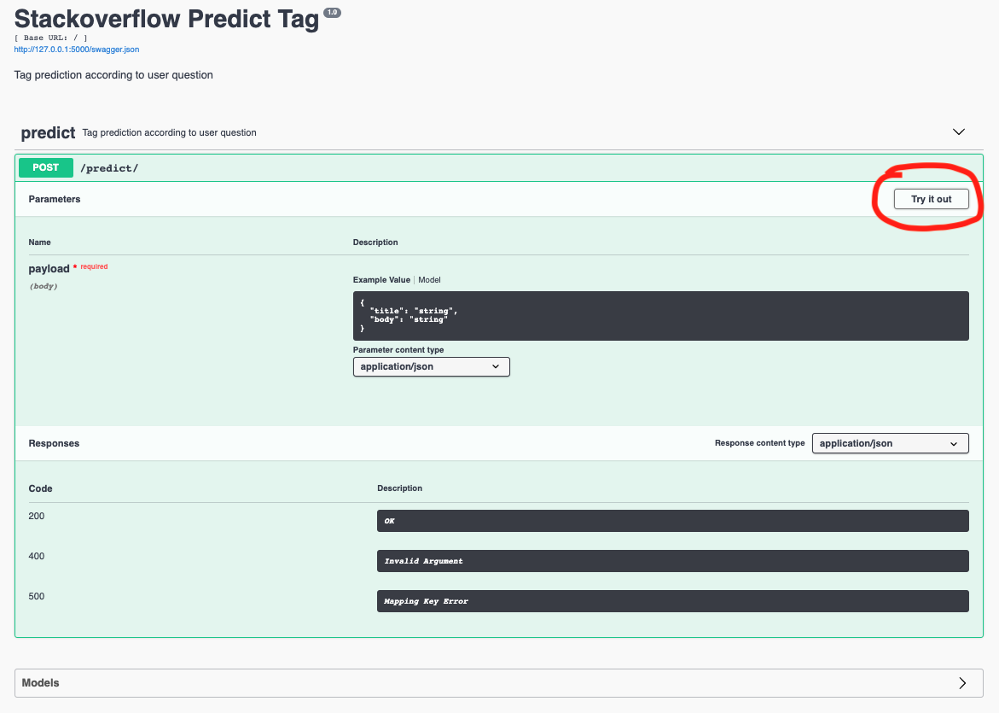
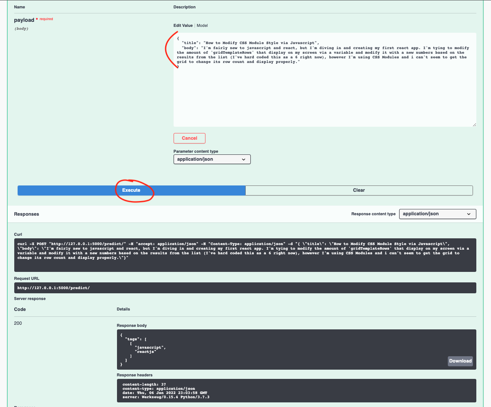

# API_Tags_Generator

## Table of Contents
1. [General Info](#general-info)
2. [Technologies](#technologies)
4. [Installation](#installation)

### General Info
***
An API based on the XGBoost model to test tags generation.

Training notebooks are available here: https://github.com/nimra-boy/ML-Stackoverflow-tags-generator

## Technologies
***
A list of technologies used within the project:
* [python](https://www.python.org/): Version 3.7
* [flask](https://flask.palletsprojects.com/en/2.0.x/): Version 1.0.3
* [flask_restplus](https://github.com/noirbizarre/flask-restplus): Version 0.12.1
* [joblib](https://joblib.readthedocs.io/en/latest/): Version 1.0.1
* [nltk](https://www.nltk.org/): Version 3.2.4

## Installation
***
* Download the code
* Install pipenv
  - Linux 
  ```
  $ sudo apt install python3-pip
  $ python3 -m pip install pipenv
  $ pipenv --version
  ```
  - Windows
  ```
  $ python3 -m pip install pipenv
  $ pipenv --version
  ```
  - Mac
  ```
  $ brew install pipenv
  $ pipenv --version
  ```
* Install dependencies
```
$ pipenv install -r requirements.txt --python 3.7
```
* Open shell
```
$ pipenv shell
```
* Run flask api
```
$ export FLASK_APP=app.py
$ export FLASK_ENV=development
$ flask run
```
* Go to http://127.0.0.1:5000/ and click on "Try it out"

* Enter a title and a description then click on execute

